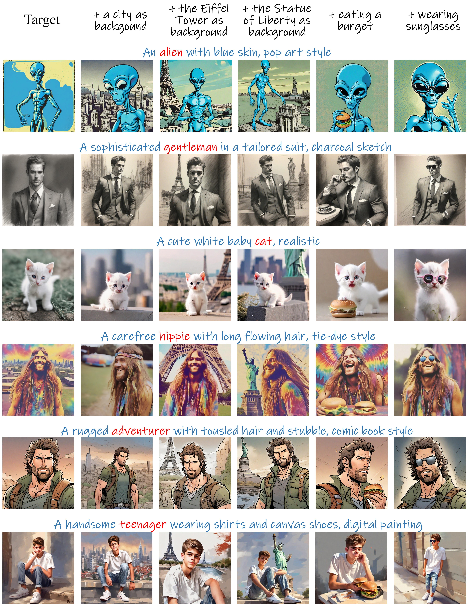

<p align="center">
  
</p>
<div align="center">

## OneActor: Consistent Character Generation via Cluster-Conditioned Guidance

#### [NeurIPS 2024]

[](https://arxiv.org/pdf/2404.10267) &ensp; [](https://arxiv.org/abs/2404.10267) &ensp; [](https://johnneywang.github.io/OneActor-webpage/)
</div>

---
This is the official code of OneActor, which allows users to generate **consistent images of a preferred character solely driven by text prompts**. Hope you have fun with this demo!

---

## 🌈 Gallery
<div align="center">
    
    <br><br><br>
    
</div>

## 🛠️ Usage
This code is designed to drive on NVIDIA A100 GPU, use this code to install the required packages:

    conda create -n oneactor python=3.10
    conda activate oneactor
    pip install -r requirements.txt
#### Specify Paths
Please edit the `./PATH.json` to specify the paths to the code and the StableDiffusionXL model.
#### Generate Target Image
Please change the prompt and other settings in `/config/gen_tune.yaml` or you can leave it to the default setting.
Use this code to generate the target image and the auxiliary images:

    python generate_data.py
The images will be saved at `./data/demo`.
#### Tune the Projector

    python tune.py
#### Inference for Consistent Images
Please change the prompt and other settings in `./config/inference.yaml` or you can leave it to the default setting.
Use this code to generate the desired consistent image:

    python inference.py
The images will be saved at `./output/demo/inference`.

## 📖 Citation
If you are inspired by our work, please cite our paper.
```bibtex
@inproceedings{wang2024oneactor,
      title={OneActor: Consistent Character Generation via Cluster-Conditioned Guidance},
      author={Wang, Jiahao and Yan, Caixia and Lin, Haonan and Zhang, Weizhan},
      booktitle={Advances in Neural Information Processing Systems},
      year={2024}
    }
```
